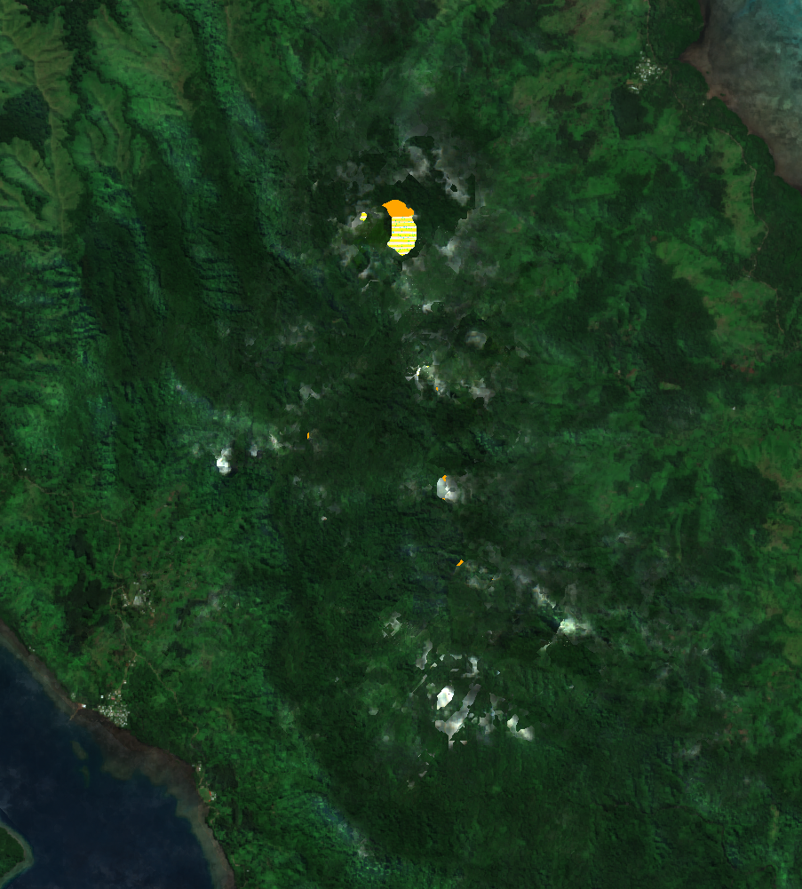
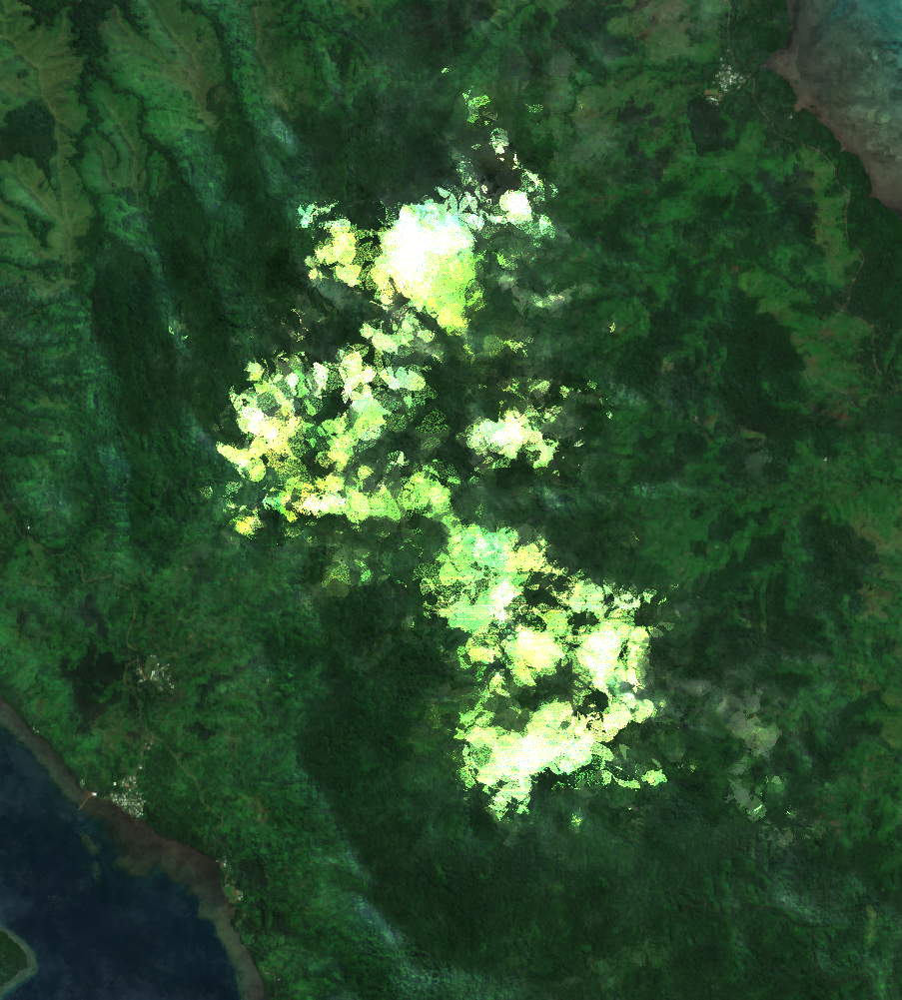
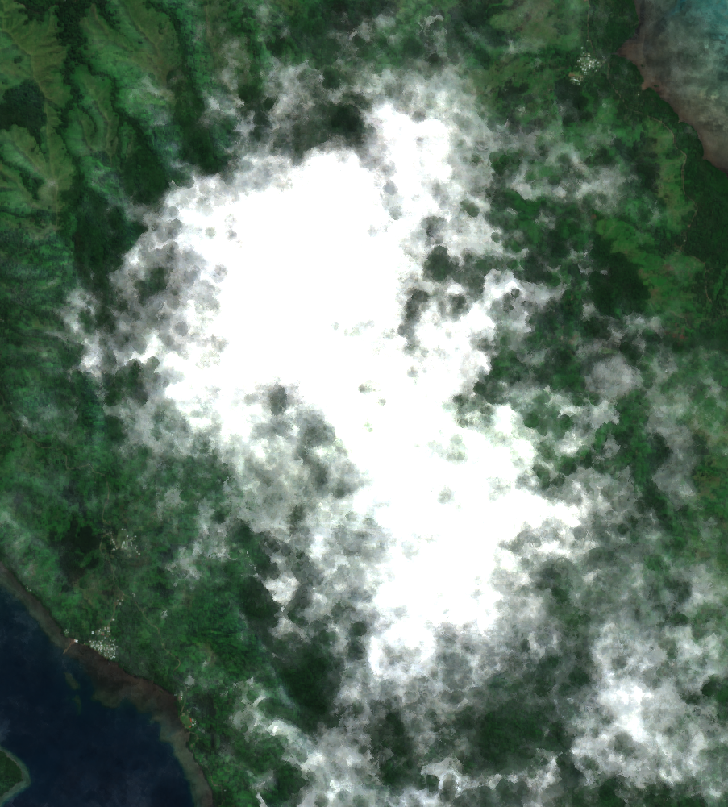
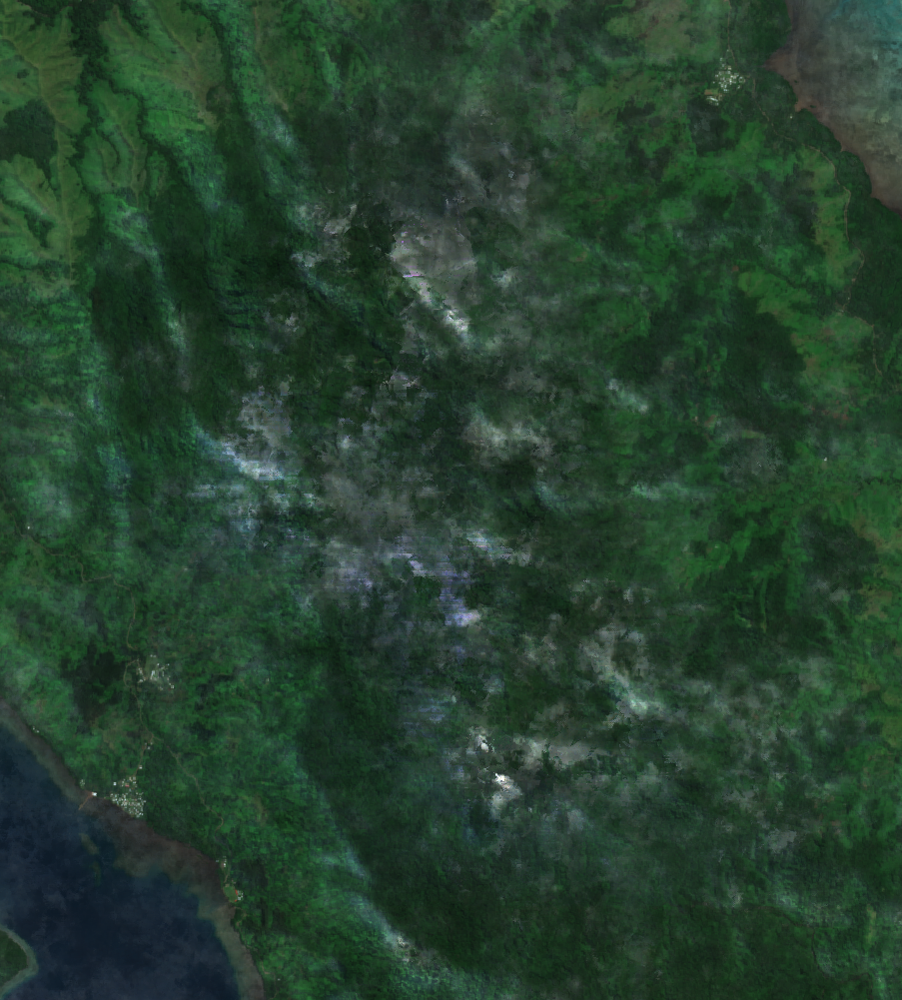

# Cloud mask trial: Fiji Gao

Five cloud-masking configurations, tested on the same region (`fiji_gao`, from
`tests/test_regions.geojson`) over the same 2025 Sentinel-2 time series
(~71-81 scenes, geobox capped at ~1000x1000 px, generated by
`tests/compare_masks.py`). Fiji Gao was a useful stress test: it's a
persistently cloudy tropical region where only 10-16 of ~71 scenes are
actually clear at a typical pixel, so weaknesses in a masking method show up
clearly in the composite.

All five feed into the same full geomedian compute
(`datacube_compute.geomedian_with_mads`) — the only thing that changes
between images is which pixels get excluded before compositing.

## The images

### `fiji_gao_old.png` — production baseline

The current production "old" filter style:
[`dep_tools.s2_utils.mask_clouds`](https://github.com/digitalearthpacific/dep-tools),
filters `[dilation(3), erosion(2)]`, applied to the combined
`{saturated/defective, cloud shadows, cloud medium/high probability, thin
cirrus}` SCL classes as one mask. This is what the deployed pipeline
actually runs today.

**Result**: clean, but with one visible residual-cloud artifact (a faint
rainbow-striped patch) that the light `dilation(3)/erosion(2)` morphology
didn't fully clean up.

### `fiji_gao_new.png` — candidate: combined SCL classes, 3,3,3 morphology

The starting point for this whole trial. Combines just the medium+high cloud
probability SCL classes into one mask (rather than each class getting its
own filter independently), applies `opening(3) -> closing(3) -> dilation(3)`
to that combined mask, then unions in saturated/defective pixels
unmorphed. Thin cirrus and cloud shadow are left alone.

**Thinking**: opening removes speckle noise in the raw per-pixel SCL flags,
closing fills small holes, dilation buffers the edges — a fuller cleanup
pass than the production config's simple dilate/erode.

**Result**: the cleanest of all five. No visible residual cloud artifacts.
**This is the best-performing config across the whole trial.**

### `fiji_gao_omni.png` — candidate: OmniCloudMask

Swaps the SCL band out entirely for
[OmniCloudMask](https://github.com/DPIRD-DMA/OmniCloudMask), a Red/Green/NIR
deep-learning cloud/shadow segmenter, run per-scene (its `predict_from_array`
only takes one `(3, H, W)` image at a time, so this loops over every
timestep individually — the slowest of the five configs by a wide margin).
Only its "thick cloud" class is masked (thin cloud and shadow are left
alone, matching "new"'s scope), cleaned up with the same 3,3,3 morphology.

**Thinking**: a second opinion independent of Sen2Cor's SCL classifier,
in case SCL was systematically missing something structural.

**Result**: close to "new" but not quite as clean — a couple of small
residual artifacts survived. Its raw per-scene predictions were also
noticeably inconsistent in coverage across dates before the 3,3,3 buffer was
added (see conversation history for the diagnostic class-map images, since
deleted). Slower to run than any SCL-based config, for a slightly worse
result.

*(A fourth candidate, [s2cloudless](https://github.com/sentinel-hub/sentinel2-cloud-detector),
was tried and dropped before producing an image here — it needs a real B10
(cirrus) band, which Sentinel-2 L2A doesn't have, and zero-filling that
channel badly under-detected cloud.)*

### `fiji_gao_tmask.png` — candidate: multi-temporal robust-outlier ("Tmask")

A simplified version of Zhu & Woodcock's (2014) Tmask: instead of
classifying each scene independently, flags an observation as cloud when
it's anomalously bright relative to *that same pixel's own* robust
statistics across the whole time series — self-referencing, so it isn't
fooled by permanently bright surfaces. Uses a low percentile (not the
median) as the "clear" reference, refined in two passes (excluding pass-1
outliers before re-estimating the reference), voting across blue/green/NIR.

**Thinking**: exploits the same multi-date stack the geomedian already
needs, without depending on any per-scene classifier (SCL or ML) at all.

**Result**: the worst of the five. Even after tuning (single-pass ->
2-pass refinement -> added NIR), it only ever masked ~40-45% of
observations, versus ~78-85% for the other configs — a large contiguous
patch of real cloud in the middle of the scene never got excluded. Root
cause: this region's clear-observation fraction is too low (~15-22%) for a
non-iterative robust-statistics approach to work — the core assumption
("most observations at a pixel are clear") doesn't hold here. Zhu &
Woodcock's actual Tmask uses full RIRLS harmonic regression, which is a
meaningfully bigger implementation than this trial attempted.

### `fiji_gao_and.png` — candidate: SCL ∩ OmniCloudMask (intersection)

An ensemble of the two configs above: a pixel is only masked as cloud where
the *raw* (pre-morphology) SCL medium+high classes **and** OmniCloudMask's
raw thick-cloud detection agree, with the 3,3,3 morphology applied to the
intersection afterwards (not to each mask separately before combining).

**Thinking**: intersecting two independent detectors should reduce false
positives from either one alone, and can never mask *more* than the more
generous of the two — so it should only ever improve coverage relative to
using either config on its own.

**Result**: coverage did improve (no more large solid-white patches), but a
distinct hazy/grey diagonal band and a couple of purple speckle artifacts
appeared that neither "new" nor "omni" showed this prominently — real cloud
that only one of the two methods flags now slips through unmasked. Net,
**worse than "new" alone**: the coverage gain wasn't worth the contamination
it let back in.

## Conclusion

`new` (combined SCL medium+high classes, `opening(3)->closing(3)->dilation(3)`
morphology, saturated/defective unmorphed) is the winner of this trial by a
clear margin, and also the simplest and cheapest of the five to run. Three
independent alternatives — a deep-learning segmenter, a from-scratch
multi-temporal statistical method, and an ensemble of the first two — all
underperformed it on this genuinely hard, persistently-cloudy test region.

Ideas not pursued, for a future trial:
- **Elevation-dependent masking** — this region's residual contamination is
  concentrated over higher terrain (orographic cloud), so a
  DEM-aware threshold might target it more precisely than any of the
  spectral/temporal approaches tried here.
- A properly-implemented Tmask (harmonic regression + iterative reweighting,
  not the 2-pass heuristic used here).
- Regardless of method, some pixels in this region simply don't have enough
  cloud-free observations across a year to composite cleanly — a ceiling no
  masking algorithm alone can fix.
